<div align=center>
    
    <hr>
    <p><i>Site</i> de uma cafeteria, desenvolvido para a disciplina Projeto Integrador Transdisciplinar em Ciência da Computação II - PIT II, Universidade Cruzeiro do Sul, modalidade EAD.</p>
    
    
    
    
    
    <p style="margin:1.5rem 0">⚠️🚧 Em construção 🚧⚠️</p>
</div>

<h2 style="font-size:2.5rem;">Tabela de conteúdos</h2>

<!--ts-->
   * [Sobre o projeto](#sobre-o-projeto)
   * [Funcionalidades](#funcionalidades)
   * [Layout](#layout)
     * [Mobile](#mobile)
     * [Desktop](#desktop)
   * [Como executar o projeto](#como-executar-o-projeto)
     * [Pré-requisitos](#pré-requisitos)
     * [Configurando arquivo .env](#configurando-arquivo-env)
     * [Instalação do projeto](#instalação-do-projeto)
     * [Executando o projeto](#executando-o-projeto)
   * [Tecnologias](#tecnologias)
   * [Autor](#autor)
   * [Licença](#user-content--licença)
<!--te-->

## Sobre o projeto

Ponto do Café é um projeto desenvolvido para a disciplina Projeto Integrador Transdisciplinar em Ciência da Computação II - PIT II, na Universidade Cruzeiro do Sul, modalidade EAD.

Na disciplina anterior (PIT I) criou-se toda a base para a construção deste projeto.

## Funcionalidades

<ul>
    <li>Os usuários têm acesso ao projeto em diferentes dispositivos, seja <i>mobile</i> e/ou <i>desktop</i>, onde podem:
        <ul>
            <li>Cadastrar no <i>site</i>;</li>
            <li>Visualizar produtos oferecidos pela cafeteria;</li>
            <li>Adicionar produtos de interesse ao carrinho;</li>
            <li>Gerenciar os produtos adicionados, incrementando/decrementando quantidades, ou até mesmo removendo-o(s) do carrinho;</li>
            <li>Visualizar receitas que possuem como base o café;</li>
            <li>Enviar receitas, para ajudar a enriquecer o <i>site</i>;</li>
            <li>Suporte via <i>e-mail</i> ou <i>Whatsapp</i>;</li>
            <li>Conhecer um pouco mais sobre a cafeteria e seus propósitos;</li>
        </ul>
    </li>
</ul>

## Layout

Abaixo seguem algumas imagens do projeto

### Mobile

<div align="center" style="display:flex; gap:.5rem; align-items: flex-start; justify-content: center; flex-wrap: wrap;">
    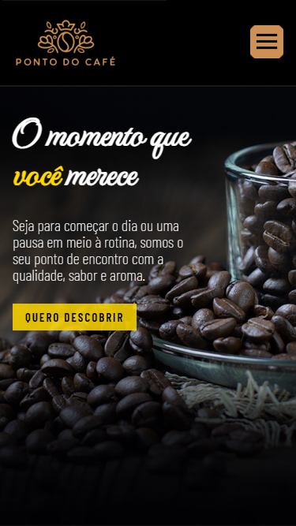
    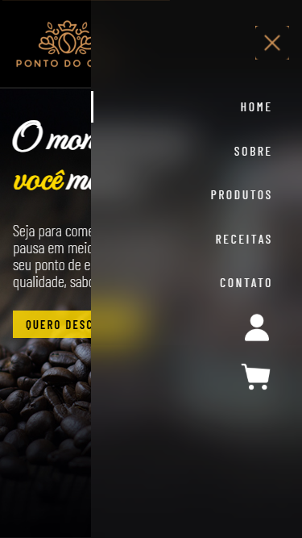
    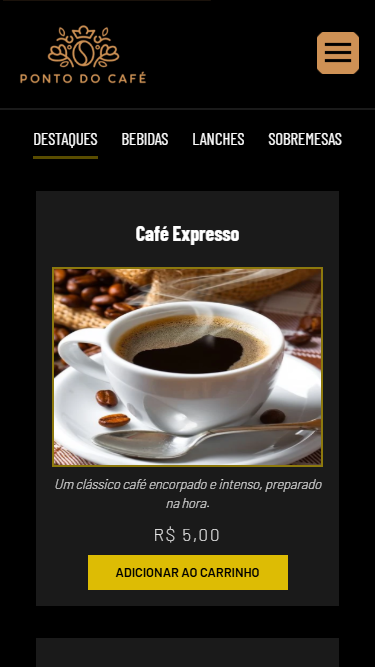
    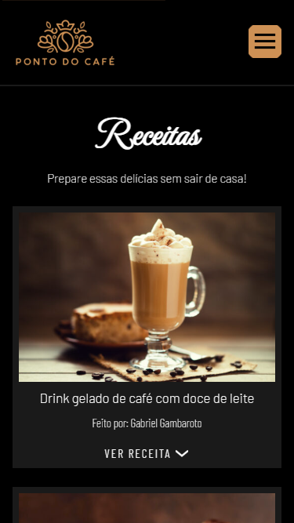
    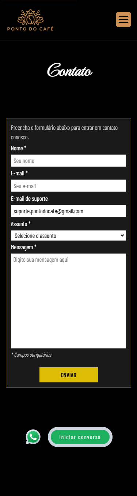
    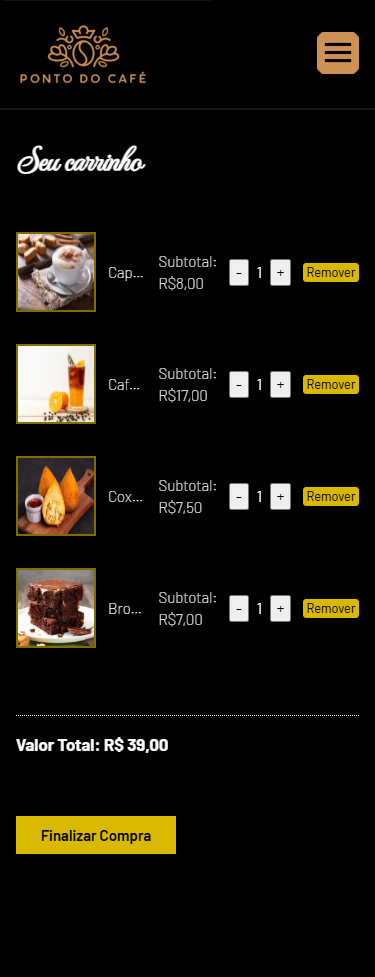
</div>

### Desktop

<div align="center" style="display:flex; gap:.5rem; align-items: flex-start; justify-content: center; flex-wrap: wrap;">
    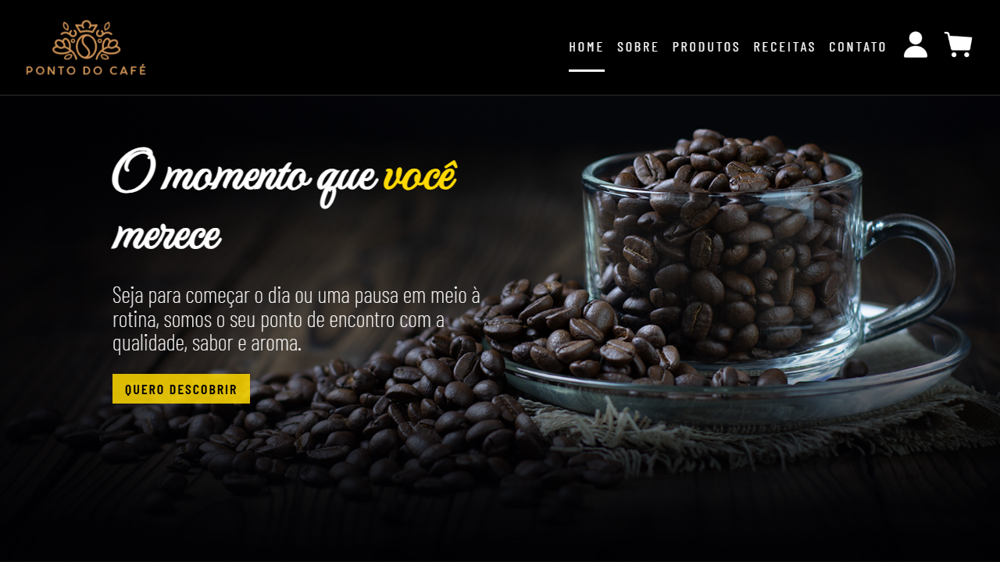
    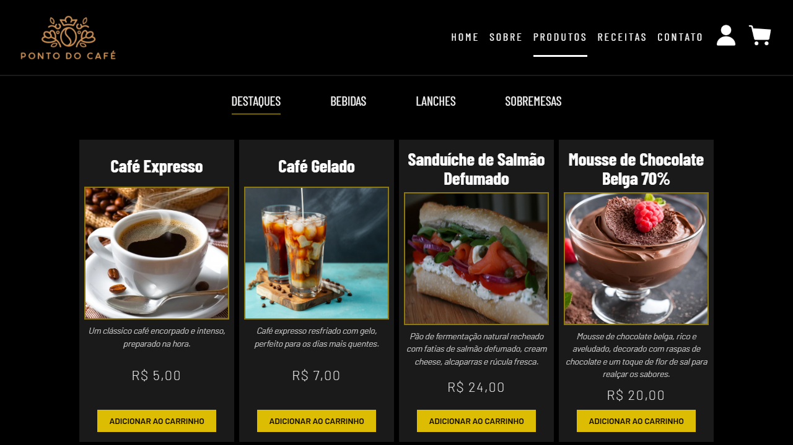
    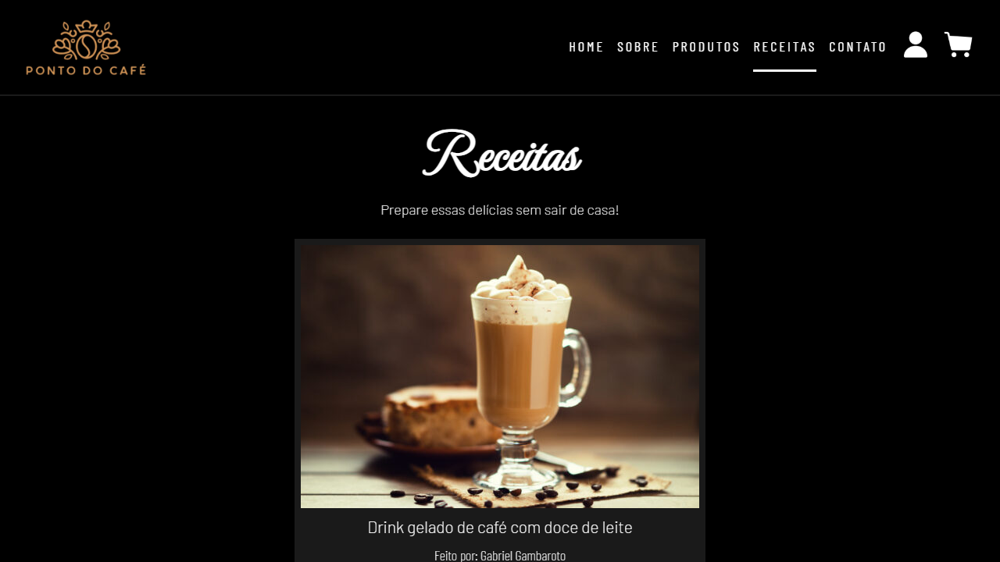
    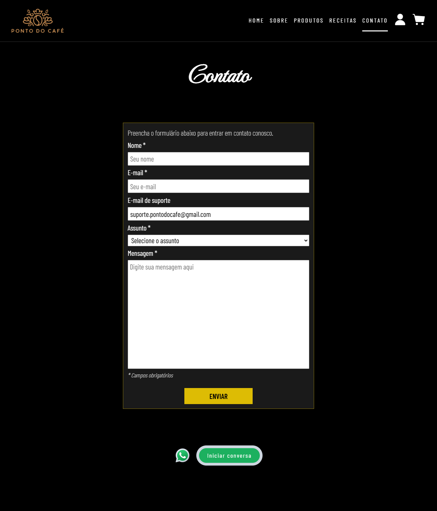
    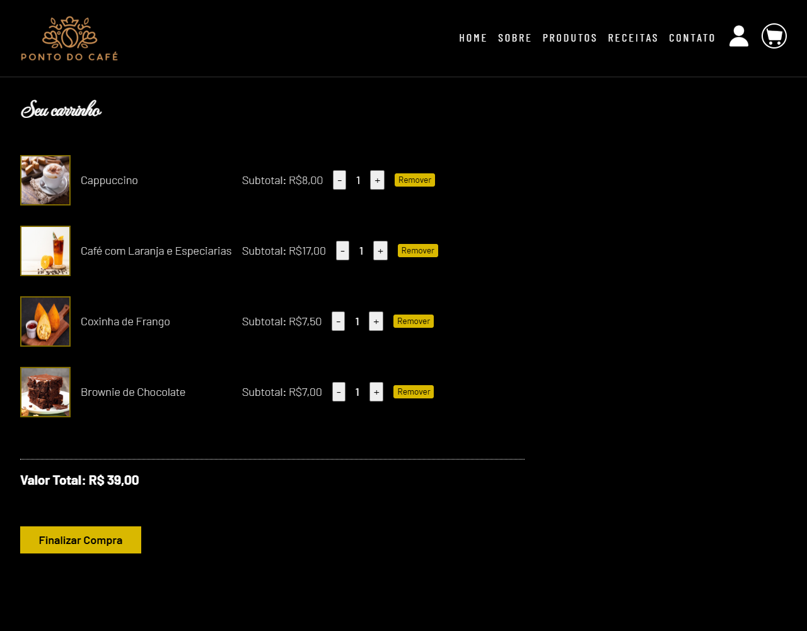
</div>

## Como executar o projeto

### Pré-requisitos

Antes de começar, você vai precisar ter instalado em sua máquina as seguintes ferramentas:
[Git](https://git-scm.com), [Node.js](https://nodejs.org/en/). 

Além disso é bom ter um editor para trabalhar com o código, como [VSCode](https://code.visualstudio.com/).

Para completar, é necessário a instalação de um banco de dados configurado com nome, host, usuário e senha. Sugiro o [MySQL Workbench](https://www.mysql.com/products/workbench/).

### Configurando arquivo .env

Para configurar as variáveis de ambiente, faça:

1 - Copiar o arquivo de exemplo

```bash
cp .env.example .env
```

2 - Preencher as variáveis no arquivo .env com valores apropriados

```
DB_HOST=<endereco_do_host>
DB_USER=<usuario_do_bd>
DB_PASSWORD=<senha_do_bd>
DB_NAME=<nome_do_bd>
```

### Instalação do projeto

Passos para instalar e rodar o projeto localmente:

1 - Clone o repositório

```bash
git clone https://github.com/Hugo-Moreira91/projeto-ponto-do-cafe.git
cd projeto-ponto-do-cafe
```

2 - Instale as dependências

```bash
npm install
```

### Executando o projeto

1 - Iniciar o servidor local

```bash
npm start
```

OU

2 - Iniciar em modo de desenvolvimento

```bash
npm run dev
```

## Tecnologias

As seguintes ferramentas foram utilizadas na construção do projeto:

- Server ([Node.js](https://nodejs.org/en/))
    - [bcryptjs](https://www.npmjs.com/package/bcryptjs)
    - [body-parser](https://www.npmjs.com/package/body-parser)
    - [dotenv](https://github.com/motdotla/dotenv)
    - [express](https://expressjs.com/)
    - [mysql2](https://www.npmjs.com/package/mysql2)

Veja o arquivo [package.json](https://github.com/Hugo-Moreira91/projeto-ponto-do-cafe/blob/main/package.json) para mais detalhes.

- Utilitários
    - Editor: [Visual Studio Code](https://code.visualstudio.com/)
    - Ícones: [favicon.io](https://favicon.io/), [icons8](https://icons8.com.br/)
    - Fontes: [Barlow](https://fonts.google.com/specimen/Barlow), [Balow Condensed](https://fonts.google.com/specimen/Barlow+Condensed), [MonteCarlo](https://fonts.google.com/specimen/MonteCarlo)

## Autor

<a href="https://github.com/Hugo-Moreira91">
    
    <br/ >
    <p>Hugo Moreira 🚀</p>
</a>
<p>Feito com ❤️</p>
<p>Entre em contato! 👇🏼</p>

[](https://x.com/HugoCsarSantos1)
[](https://www.linkedin.com/in/hugo-c%C3%A9sar-santos-moreira-a10823248/)
[](mailto:hugo.cesar91@gmail.com)